# Raspberry Pi I2S Audio Wiring

This wiring is for the Raspberry Pi 4 all-in-one audio design using an INMP441 I2S microphone and a MAX98357 I2S amplifier.

## Pin Map

| Raspberry Pi physical pin | BCM GPIO | Signal | Connects to |
| --- | --- | --- | --- |
| Pin 1 | 3.3V | Mic power | INMP441 `VDD` |
| Pin 4 | 5V | Amp power | MAX98357 `VIN` |
| Pin 6 | GND | Mic ground | INMP441 `GND` |
| Pin 9 | GND | Amp ground | MAX98357 `GND` |
| Pin 12 | GPIO 18 | I2S BCLK / bit clock | INMP441 `SCK`, MAX98357 `BCLK` |
| Pin 35 | GPIO 19 | I2S FS / LRCLK / word select | INMP441 `WS`, MAX98357 `LRC` |
| Pin 38 | GPIO 20 | I2S DOUT / data output | MAX98357 `DIN` |
| Pin 40 | GPIO 21 | I2S DIN / data input | INMP441 `SD` |
| Pin 14 | GND | Amp gain select | MAX98357 `GAIN` for 9 dB |

Speaker wiring:

| MAX98357 | Speaker |
| --- | --- |
| Speaker+ | Speaker positive |
| Speaker- | Speaker negative |

## Wiring Diagram

```mermaid
flowchart TB
    subgraph RASPBERRY_PI["Raspberry Pi 4 GPIO Pinout"]
        direction TB

        subgraph I2S_PINS["I2S Audio Pins"]
            PIN_12["GPIO 18 (BCM 18)<br/>I2S BCLK<br/>Bit Clock"]
            PIN_35["GPIO 19 (BCM 19)<br/>I2S FS/LRCLK<br/>Frame Sync"]
            PIN_40["GPIO 21 (BCM 21)<br/>I2S DIN<br/>Data Input from MIC"]
            PIN_38["GPIO 20 (BCM 20)<br/>I2S DOUT<br/>Data Output to Speaker"]
        end

        subgraph POWER_PINS["Power and Ground"]
            PIN_1["Pin 1<br/>3.3V"]
            PIN_4["Pin 4<br/>5V"]
            PIN_6["Pin 6<br/>GND"]
            PIN_9["Pin 9<br/>GND"]
            PIN_14["Pin 14<br/>GND"]
        end
    end

    subgraph MICROPHONE["INMP441 I2S Microphone"]
        MIC_VDD["VDD<br/>3.3V"]
        MIC_GND["GND"]
        MIC_SD["SD/SDOUT<br/>Data Out"]
        MIC_SCK["SCK/BCLK<br/>Bit Clock"]
        MIC_WS["WS/LRCLK<br/>Word Select"]
    end

    subgraph AMPLIFIER["MAX98357 I2S Amplifier"]
        AMP_VIN["VIN<br/>5V"]
        AMP_GND["GND"]
        AMP_BCLK["BCLK<br/>Bit Clock"]
        AMP_LRC["LRC/LRCLK<br/>Frame Sync"]
        AMP_DIN["DIN/SDATA<br/>Data In"]
        AMP_GAIN["GAIN<br/>GND = 9 dB<br/>3.3V = 15 dB"]
    end

    subgraph SPEAKER["Speaker"]
        SPK_POS["Speaker+"]
        SPK_NEG["Speaker-"]
    end

    PIN_1 --> MIC_VDD
    PIN_6 --> MIC_GND
    PIN_12 --> MIC_SCK
    PIN_35 --> MIC_WS
    MIC_SD --> PIN_40

    PIN_4 --> AMP_VIN
    PIN_9 --> AMP_GND
    PIN_12 --> AMP_BCLK
    PIN_35 --> AMP_LRC
    PIN_38 --> AMP_DIN
    PIN_14 --> AMP_GAIN

    AMPLIFIER --> SPK_POS
    AMPLIFIER --> SPK_NEG

    classDef pi fill:#4caf50,stroke:#1b5e20,color:#fff
    classDef mic fill:#2196f3,stroke:#0d47a1,color:#fff
    classDef amp fill:#ff9800,stroke:#e65100,color:#fff
    classDef speaker fill:#f44336,stroke:#b71c1c,color:#fff

    class RASPBERRY_PI,I2S_PINS,POWER_PINS pi
    class MICROPHONE,MIC_VDD,MIC_GND,MIC_SD,MIC_SCK,MIC_WS mic
    class AMPLIFIER,AMP_VIN,AMP_GND,AMP_BCLK,AMP_LRC,AMP_DIN,AMP_GAIN amp
    class SPEAKER,SPK_POS,SPK_NEG speaker
```



## Raspberry Pi OS Configuration

The runner checks ALSA visibility, but wiring alone is not enough. The Pi must expose an ALSA capture device for the INMP441 and an ALSA playback device for the MAX98357.

Typical files to inspect:

```bash
/boot/firmware/config.txt
/etc/asound.conf
~/.asoundrc
```

Common overlay direction:

```text
# MAX98357 I2S output commonly uses an I2S DAC overlay.
# Exact overlay names vary by OS/kernel image.
dtoverlay=hifiberry-dac

# INMP441 capture commonly needs an I2S microphone/ADC overlay or custom simple-audio-card config.
# Verify available overlays with: ls /boot/firmware/overlays | grep -Ei 'i2s|mic|dac|hifi'
```

After changing boot audio overlays, reboot the Pi and run:

```bash
cd /home/phuong/robot_voice
bash scripts/pi_process.sh check
```

Expected result for this hardware design:

```text
Capture devices: one ALSA card for INMP441 or I2S microphone
Playback devices: one ALSA card for MAX98357 or I2S DAC
```
