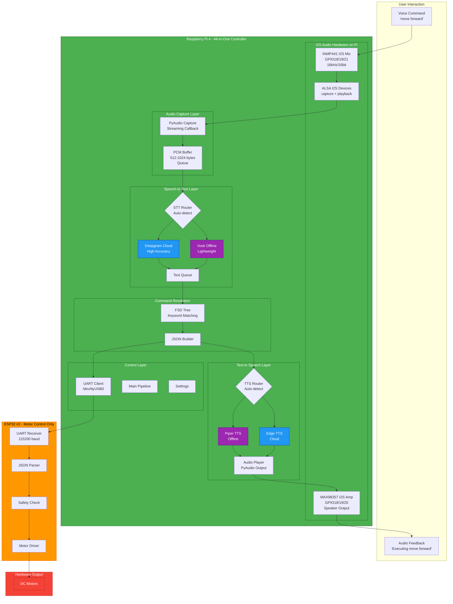

# System Design: Raspberry Pi All-in-One Voice Controller

This document describes the target architecture for the robot voice-control system. The Raspberry Pi 4 owns voice capture, speech recognition, command resolution, text-to-speech feedback, and UART command output. ESP32 #2 is kept narrow: motor control and hardware safety.

## Target Flow

## Component Responsibilities

| Layer | Responsibility | Preferred implementation |
| --- | --- | --- |
| Audio hardware | Capture user voice and play feedback | INMP441 I2S microphone and MAX98357 I2S amplifier |
| Audio capture | Stream 16 kHz 16-bit mono PCM into a queue | PyAudio / ALSA |
| STT router | Select online or offline speech recognition | Deepgram if key/network available, otherwise Vosk |
| Command resolution | Convert recognized text into robot command JSON | `FsdTree.resolve_command()` |
| TTS router | Speak feedback after command resolution | Piper offline, Edge TTS cloud fallback/option |
| UART client | Send compact JSON command to motor controller | `/dev/ttyUSB0` at 115200 baud |
| ESP32 motor | Enforce hard real-time motor safety | JSON parser, timeout stop, speed clamp |

## Current Implementation Status

Implemented now:

- Text command dry-run on Windows and Raspberry Pi.
- FSD command resolver with common aliases and typo tolerance for `foward`.
- UART JSON output with dry-run mode.
- Deepgram streaming STT module.
- USB CDC frame parser from the previous ESP32 microphone design.
- One-time Pi runner: `scripts/pi_process.sh`.
- Unit tests for command resolution, UART dry-run, settings, PCM, and USB CDC frames.

Target additions from this design:

- Pi-local microphone capture through ALSA/PyAudio.
- STT router that chooses Deepgram or Vosk.
- TTS router that chooses Piper or Edge TTS.
- Audio playback through Pi audio output.
- A new `pi_audio` runtime mode that replaces the older ESP32 USB CDC microphone path.

Hardware wiring: [I2S_WIRING.md](I2S_WIRING.md).

## Development Plan

1. Add an audio device probe to `pi_process.sh` using `arecord -l` and `aplay -l`.
2. Add `src/audio/pi_capture.py` for USB/ALSA microphone capture.
3. Add `src/stt/router.py` with Deepgram-first and Vosk fallback behavior.
4. Add `src/tts/router.py` with Piper-first and Edge fallback behavior.
5. Add a `ROBOT_WORKFLOW=pi_audio` pipeline.
6. Keep `ROBOT_DRY_RUN=1` until STT, command output, and TTS feedback are verified.
7. Enable `ROBOT_DRY_RUN=0` only after ESP32 motor firmware safety checks are validated.
