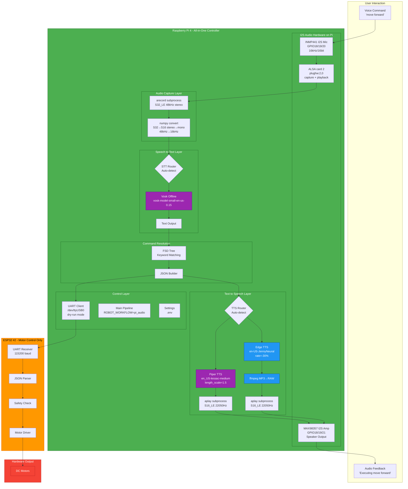

# System Architecture

Current pipeline as implemented on the Raspberry Pi 4.

```mermaid
flowchart TB
    subgraph USER["User Interaction"]
        Voice["Voice Command<br/>'move forward'"]
        Feedback["Audio Feedback<br/>'Executing move forward'"]
    end

    subgraph RASPBERRY_PI["Raspberry Pi 4 - All-in-One Controller"]
        direction TB

        subgraph AUDIO_HARDWARE["I2S Audio Hardware on Pi"]
            MIC_USB["INMP441 I2S Mic<br/>GPIO18/19/20<br/>16kHz/16bit"]
            SPEAKER_3MM["MAX98357 I2S Amp<br/>GPIO18/19/21<br/>Speaker Output"]
            AUDIO_DEVICE["ALSA card 2<br/>plughw:2,0<br/>capture + playback"]
        end

        subgraph AUDIO_CAPTURE["Audio Capture Layer"]
            ARECORD["arecord subprocess<br/>S32_LE 48kHz stereo"]
            PCM_CONVERT["numpy convert<br/>S32→S16 stereo→mono<br/>48kHz→16kHz"]
        end

        subgraph STT_LAYER["Speech to Text Layer"]
            STT_ROUTER{"STT Router<br/>Auto-detect"}
            VOSK["Vosk Offline<br/>vosk-model-small-en-us-0.15"]
            STT_QUEUE["Text Output"]
        end

        subgraph FSD_LAYER["Command Resolution"]
            FSD_TREE["FSD Tree<br/>Keyword Matching"]
            COMMAND_BUILDER["JSON Builder"]
        end

        subgraph TTS_LAYER["Text to Speech Layer"]
            TTS_ROUTER{"TTS Router<br/>Auto-detect"}
            PIPER["Piper TTS<br/>en_US-lessac-medium<br/>length_scale=1.5"]
            EDGE["Edge TTS<br/>en-US-JennyNeural<br/>rate=-30%"]
            APLAY_PIPER["aplay subprocess<br/>S16_LE 22050Hz"]
            FFMPEG["ffmpeg MP3→RAW"]
            APLAY_EDGE["aplay subprocess<br/>S16_LE 22050Hz"]
        end

        subgraph CONTROL["Control Layer"]
            UART_CLIENT["UART Client<br/>/dev/ttyUSB0<br/>dry-run mode"]
            MAIN_PIPELINE["Main Pipeline<br/>ROBOT_WORKFLOW=pi_audio"]
            SETTINGS["Settings<br/>.env"]
        end
    end

    subgraph ESP32_MOTOR["ESP32 #2 - Motor Control Only"]
        UART_RX["UART Receiver<br/>115200 baud"]
        JSON_PARSER["JSON Parser"]
        SAFETY["Safety Check"]
        MOTOR_DRIVER["Motor Driver"]
    end

    subgraph HARDWARE["Hardware Output"]
        MOTORS["DC Motors"]
    end

    Voice --> MIC_USB
    MIC_USB --> AUDIO_DEVICE
    AUDIO_DEVICE --> ARECORD
    ARECORD --> PCM_CONVERT
    PCM_CONVERT --> STT_ROUTER

    STT_ROUTER --> VOSK
    VOSK --> STT_QUEUE
    STT_QUEUE --> FSD_TREE

    FSD_TREE --> COMMAND_BUILDER
    COMMAND_BUILDER --> UART_CLIENT
    COMMAND_BUILDER --> TTS_ROUTER

    TTS_ROUTER --> PIPER
    TTS_ROUTER --> EDGE
    PIPER --> APLAY_PIPER
    EDGE --> FFMPEG
    FFMPEG --> APLAY_EDGE
    APLAY_PIPER --> SPEAKER_3MM
    APLAY_EDGE --> SPEAKER_3MM
    SPEAKER_3MM --> Feedback

    UART_CLIENT --> UART_RX
    UART_RX --> JSON_PARSER
    JSON_PARSER --> SAFETY
    SAFETY --> MOTOR_DRIVER
    MOTOR_DRIVER --> MOTORS

    classDef pi fill:#4caf50,stroke:#1b5e20,color:#fff
    classDef cloud fill:#2196f3,stroke:#0d47a1,color:#fff
    classDef local fill:#9c27b0,stroke:#4a148c,color:#fff
    classDef esp32 fill:#ff9800,stroke:#e65100,color:#000
    classDef hardware fill:#f44336,stroke:#b71c1c,color:#fff

    class RASPBERRY_PI,AUDIO_HARDWARE,AUDIO_CAPTURE,STT_LAYER,FSD_LAYER,TTS_LAYER,CONTROL pi
    class DEEPGRAM,EDGE,FFMPEG cloud
    class VOSK,PIPER local
    class ESP32_MOTOR esp32
    class HARDWARE,MOTORS hardware
```
